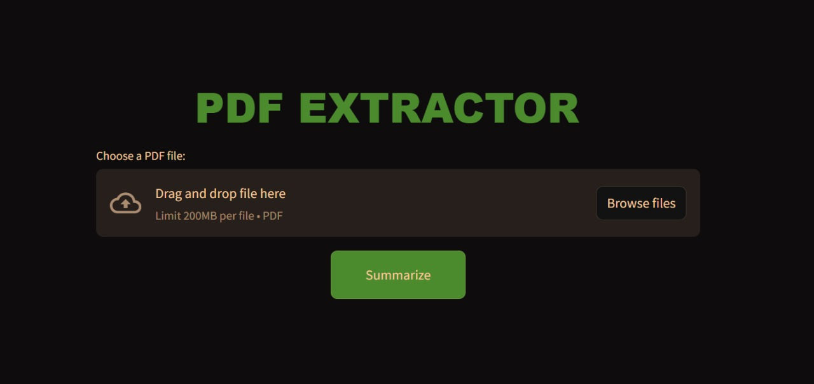
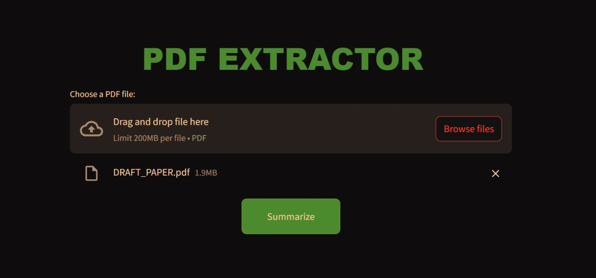
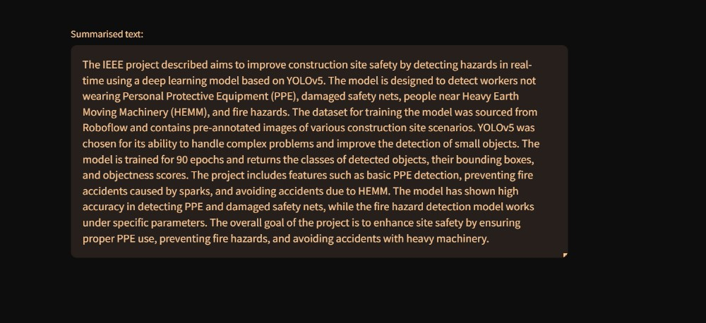

# **Paper AI Summariser 📄✨**

  
  


## **Overview 🚀**

**Paper AI Summariser** is a web-based tool that extracts text from PDFs and provides concise summaries using a **large language model (LLM)** from **Groq's Mistral family**. This project leverages **Streamlit** to create an intuitive and interactive interface, making it easy to extract insights from research papers, articles, and long documents.

---

## **Features 🛠️**

- **Upload PDFs**: Extracts text from any uploaded PDF.
- **AI-Powered Summarization**: Uses **Mistral-8x7b** LLM via Groq for high-quality summarization.
- **Interactive UI**: Powered by **Streamlit** for seamless user interaction.
- **Custom Styling**: Polished interface with tailored CSS for better aesthetics and usability.
- **Error Handling**: Captures and displays any errors from the Groq API gracefully.

---

## **Tech Stack 💻**

### **1. Language Model**

- **Groq's Mistral LLM**:  
  This summarization model (Mistral-8x7b) is an advanced, transformer-based large language model optimized for **natural language understanding and text summarization**.
  It processes large inputs and delivers high-quality, concise results.
- **Groq API**: The Groq cloud service provides access to this model via API, ensuring scalability and low-latency responses.

### **2. Streamlit**

- **Streamlit** is a **Python-based open-source app framework** for creating and sharing custom web apps for machine learning and data science.
- It simplifies the process of building UIs, making it perfect for rapid prototyping and small tools like this summariser.

---

## **Installation and Setup 🛠️**

1. **Clone the Repository**:

   ```bash

   git clone https://github.com/Harshita100/Paper-AI-Summariser.git
   cd Paper-AI-Summariser

   ```

---

2. ## **Install Dependencies**:

```bash

pip install -r requirements.txt

```

```python

client = Groq(api_key="your_groq_api_key_here")

```

```bash

streamlit run streamlit.py

```

---

## **Dependencies 📦**

Python 3.11

- _pdfplumber_:
  Extracts text from PDFs.
  Streamlit: Interactive web framework.
  Groq API: Provides access to Mistral LLM.

---

## **How It Works ⚙️**

- Upload a PDF through the Streamlit interface.
- The app uses pdfplumber to extract text from all pages of the PDF.
- Mistral LLM processes the extracted text and generates a summary.
- The summary is displayed in the interactive text area on the app.

---

## **Future Improvements 🚀**

- Add support for multi-language summarization.
- Enhance error handling for invalid PDFs or API timeouts.
- Integrate cloud storage options for uploading and saving PDFs.
- Implement a download feature for summaries in various formats (e.g., text, PDF).

---

## **Contributing 🤝**

_Contributions are welcome! Feel free to:_

Open issues for bugs or enhancements.
Submit pull requests for improvements or new features.
Discuss potential changes and features in the issues section.
Please ensure your code adheres to the existing style and includes relevant tests.

---

## **Screenshots 🖼️**

### **Main Interface**




### **Summary Output**



---

## **Contact 📧**

If you have any questions or feedback, please contact:
_Harshita – [Visit GitHub](<[https://github.com](https://github.com/Harshita100)>)_

```

```
